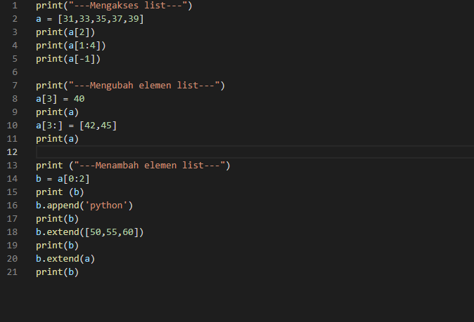
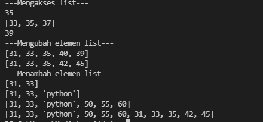
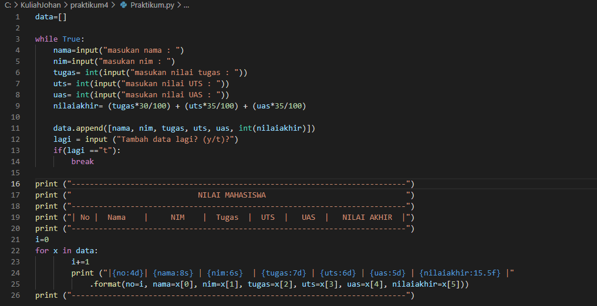
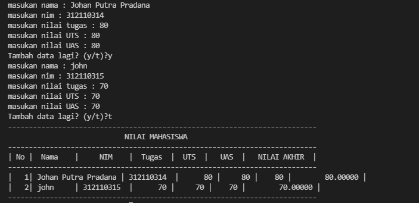
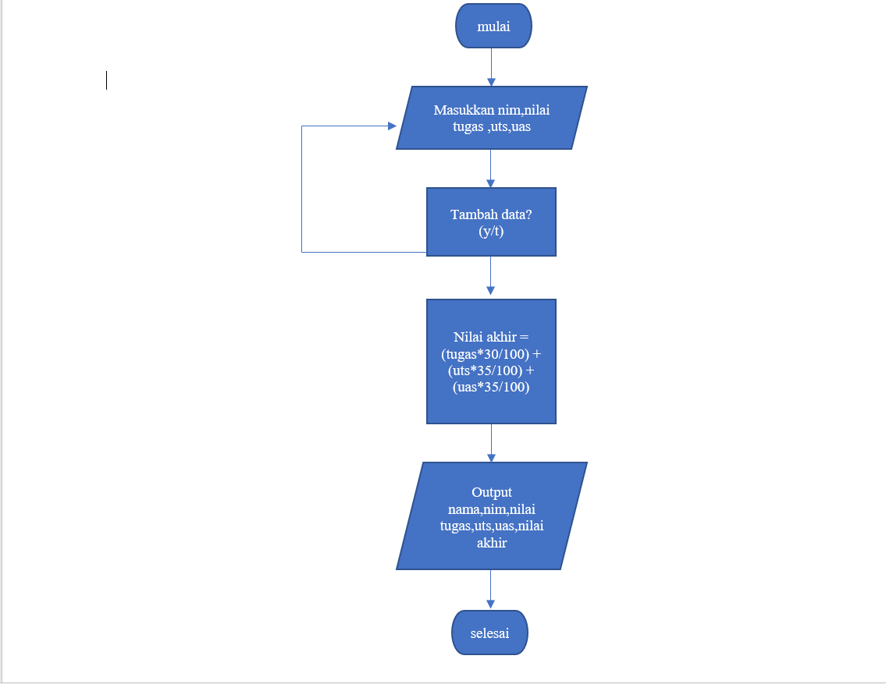

# Praktikum4 

## tugas Latihan

### program

print("---Mengakses list---")
a = [31,33,35,37,39]
print(a[2]) 
print(a[1:4]) 
print(a[-1]) 

print("---Mengubah elemen list---")
a[3] = 40
print(a)
a[3:] = [42,45]
print(a)

print ("---Menambah elemen list---")
b = a[0:2]
print (b)
b.append('python')
print(b)
b.extend([50,55,60])
print(b)
b.extend(a)
print(b)

### gambar program

### gambar hasil program

## Praktikum

### tugas program

data=[]

while True:
    nama=input("masukan nama : ")
    nim=input("masukan nim : ")
    tugas= int(input("masukan nilai tugas : "))
    uts= int(input("masukan nilai UTS : "))
    uas= int(input("masukan nilai UAS : "))
    nilaiakhir= (tugas*30/100) + (uts*35/100) + (uas*35/100)

    data.append([nama, nim, tugas, uts, uas, int(nilaiakhir)])
    lagi = input ("Tambah data lagi? (y/t)?")
    if(lagi =="t"):
        break

print ("--------------------------------------------------------------------------")
print ("                            NILAI MAHASISWA                               ")
print ("--------------------------------------------------------------------------")
print ("| No |  Nama    |     NIM    |  Tugas  |  UTS  |   UAS  |   NILAI AKHIR  |")
print ("--------------------------------------------------------------------------")
i=0
for x in data:
        i+=1
        print ("|{no:4d}| {nama:8s} | {nim:6s}  | {tugas:7d} | {uts:6d} | {uas:5d} | {nilaiakhir:15.5f} |"
            .format(no=i, nama=x[0], nim=x[1], tugas=x[2], uts=x[3], uas=x[4], nilaiakhir=x[5]))
print ("--------------------------------------------------------------------------")

### gambar program

### gambar hasil program

### flowchart

selesai